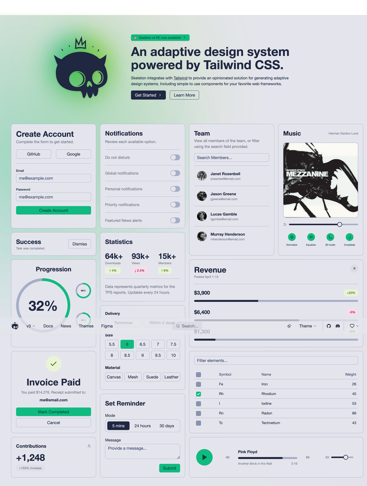

공동구매 쇼핑몰

# 1. 프로젝트 개요

공동구매를 통해 상품을 판매하는 쇼핑몰 플랫폼

- 소비자는 링크를 통해 쇼핑몰에 접근하여 상품을 주문.
- 가맹점은 판매 상품, 주문, 발주을 관리.
- 본사는 가맹점, 상품과 발주를 관리한다.

사용자 페이지는 Mobile First 전략
관리자 페이지는 Desktop First 전략

---

# 2. 기획

## 요구사항 정의서

### [본사]

#### [가맹점 관리]

- 매장 정보를 등록 할 수 있어야 한다.
- 가맹점 관리자의 승인 요청을 확인 할 수 있어야 한다.
- 가맹점 관리자의 승인 요청을 승인 할 수 있어야 한다.
- 본사 사용자가 여러명 존재할 수 있고, 이에 따른 권한 관리가 필요한지 확인 필요

#### [상품 관리]

- 매장 발주용 상품을 등록 할 수 있어야 한다.
- 매장에서 본사 상품을 판매 상품으로 등록하면 매장용 파생 상품이 생성된다.

#### [발주 관리]

- 발주 요청 내역을 확인 할 수 있어야 한다.
- 발주 요청 건에 대해 승인 할 수 있어야 한다.
- 발주 상태를 관리할 건지에 대한 확인 필요.
- 상태에 따라서 본사/가맹점이 발주 정보를 변경하지 못하도록 하는 기능도 확인 필요

#### [포인트 관리]

- 가맹점에 포인트를 등록/변경 할 수 있어야 한다.
  - 변경 히스토리 관리가 필요한지 확인 필요
- 가맹점의 포인트 사용 내역을 조회 할 수 있어야 한다.

#### [대시 보드]

- 가맹점 관리자 승인 요청 요약
- 발주 현황 요약
- 상품별 판매 현황 요약

### [가맹점]

#### [회원 관리]

- 회원 가입/로그인
  - 이메일/비밀번호를 통해 회원가입을 할 수 있어야 한다.
  - 회원가입 시 매장을 선택 할 수 있어야 한다.
  - 이메일/비밀번호를 통해 로그인 할 수 있어야 한다.
  - 본사의 승인 전에는 관리자 메뉴에 접근 할 수 없어야 한다.

#### [매장 관리]

- 매장 정보 변경

#### [판매 상품 관리]

- 판매 상품 조회
  - 본사에 등록되어 있는 상품 목록을 조회 할 수 있어야 한다.
  - 정보 변경 시 매장 상품 데이터(Products)가 생성되며,
  - 매장 상품 데이터가 생성된 상품은 목록 조회 시 매상 상품의 정보가 보인다.
  - 현재 판매 중인 상품은 주문량을 확인 할 수 있어야 한다.
- 판매 상품 정보 변경
  - 판매를 위해 상품 정보를 변경 할 수 있어야 한다.
  - 판매 가격을 변경 할 수 있어야 한다.
  - 상품의 카테고리를 변경 할 수 있어야 한다.
  - 상품의 재고(판매 가능 수량)를 설정 할 수 있어야 한다.
  - 상품의 상세 정보를 변경 할 수 있어야 한다.
  - 상품의 판매 상태를 변경 할 수 있어야 한다.

#### [주문 관리]

- 주문 조회
  - 소비자가 생성한 주문을 확인 할 수 있어야 한다.
  - 소비자로 필터링을 통해 주문 목록을 상세 조회 할 수 있어야 한다.
  - 주문 상세 정보를 조회 할 수 있어야 한다.
- 주문 확인
  - 픽업/결제 완료된 주문에 대해서는 주문 상태를 완료로 변경 할 수 있어야 한다.
    - 주문 상태: 상태값 정의 필요
- 주문 취소
  - 소비자가 생성한 주문에 대해서 취소처리를 할 수 있어야 한다.
    - 주문 상태: created → cancelled
  - 주문 완료처리한 주문에 대해서 주문 완료 취소 처리를 할 수 있어야 한다.
    - 주문 상태: completed → created

#### [발주 관리]

- 발주 신청
  - 본사에서 등록한 상품 목록을 확인하고 발주를 신청 할 수 있어야 한다.
    - 발주 신청 시에 발주 수량 만큼 stock 테이블에 업데이트 한다.
    - 원칙적으로는 입고 완료 시 업데이트해야하나, 절차 생략
  - 판매중인 상품에 대해서는 현재 주문량을 확인 할 수 있어야한다.

- 발주 내역 관리
  - 발주 신청 건에 대해서는 상태를 확인 할 수 있어야 한다.
    - 발주 상태: 상태값 정의 필요

  - 발주 상태에 따른 수정 및 취소 가능 여부 확인 필요

#### [대시 보드]

- 주문 통계 및 발주 현황을 확인 할 수 있어야 한다.

### [소비자]

#### [회원 관리]

- 회원 가입/로그인
  - 카카오 인증을 통해서 회원 가입을 진행 할 수 있어야 한다.
  - 카카오 인증을 통해서 로그인을 진행 할 수 있어야 한다.
  - 회원 가입이 성공하면 자동으로 로그인 처리되어야 한다.
  - 이미 회원 가입이 되어 있는 소비자는 자동으로 로그인 처리되어야 한다.

- 프로필 관리
  - 사용자는 닉네임, 사진 등의 개인 정보를 을 변경 할 수 있어야 한다.

#### [상품 관리]

- 상품 조회
  - 매장별 등록되어 있는 상품 목록을 조회 할 수 있어야 한다.
  - 날짜, 카테고리의 필터링을 통해 상품 목록을 상세 조회 할 수 있어야 한다.

#### [주문 관리]

- 주문 생성
  - 상품을 장바구니에 담을 수 있어야 한다.
  - 상품을 장바구니에서 제거 할 수 있어야 한다.
  - 상품의 주문 수량을 변경 할 수 있어야 한다.
  - 장바구니의 상품으로 이루어진 주문을 생성 할 수 있어야 한다.

- 주문 확인
  - 생성한 주문의 목록을 조회 할 수 있어야 한다.
  - 날짜, 카테고리의 필터링을 통해 주문 목록을 상세 조회 할 수 있어야 한다.
  - 생성한 주문의 상세 정보를 조회 할 수 있어야 한다.
  - 주문의 상태를 확인 할 수 있어야 한다.
  - 생성한 주문을 취소 할 수 있어야 한다.
  - 주문 데이터를 변경 할 수 있는 상태에 대해서 확인 필요

## 사용자 시나리오

### 본사(HQ)

| 시퀀스         | 카테고리       | 시나리오                                                                                          | 예상 결과                                              | 예외/확인 필요                                 |
| -------------- | -------------- | ------------------------------------------------------------------------------------------------- | ------------------------------------------------------ | ---------------------------------------------- |
| store-auth-01  | 회원 관리      | 가맹점 관리자는 이메일과 비밀번호로 회원가입을 진행한다.                                          | 회원 정보가 정상적으로 저장되고 승인 대기 상태가 된다. |                                                |
| store-auth-02  | 회원 관리      | 가맹점 관리자는 회원가입 시 매장을 선택한다.                                                      | 선택한 매장 정보가 회원 정보에 연결된다.               |                                                |
| store-auth-03  | 회원 관리      | 가맹점 관리자는 이메일과 비밀번호로 로그인한다.                                                   | 로그인에 성공하면 대시보드로 이동한다.                 |                                                |
| store-auth-04  | 회원 관리      | 본사의 승인이 완료되기 전에는 관리자 메뉴에 접근할 수 없다.                                       | 승인 전에는 접근 제한 메시지가 표시된다.               |                                                |
| store-store-01 | 매장 관리      | 가맹점 관리자는 매장 정보를 변경한다.                                                             | 변경된 정보가 정상적으로 저장된다.                     |                                                |
| store-prod-01  | 판매 상품 관리 | 가맹점 관리자는 본사에 등록된 상품 목록을 조회한다.                                               | 상품 목록이 화면에 표시된다.                           |                                                |
| store-prod-02  | 판매 상품 관리 | 가맹점 관리자가 상품 정보를 변경하면, 매장 상품 데이터가 생성된다.                                | 변경된 상품 정보가 매장 상품 데이터로 저장된다.        |                                                |
| store-prod-03  | 판매 상품 관리 | 매장 상품 데이터가 생성된 상품은 목록 조회 시 매장 상품의 정보가 표시된다.                        | 매장 상품 정보가 우선적으로 표시된다.                  |                                                |
| store-prod-04  | 판매 상품 관리 | 현재 판매 중인 상품의 주문량을 확인한다.                                                          | 상품별 주문량이 화면에 표시된다.                       |                                                |
| store-prod-05  | 판매 상품 관리 | 가맹점 관리자는 판매 상품의 정보를 변경한다. (판매 가격, 카테고리, 재고, 상세 정보, 판매 상태) | 변경된 정보가 정상적으로 저장된다.                     |                                                |
| store-ord-01   | 주문 관리      | 가맹점 관리자는 소비자가 생성한 주문을 확인한다.                                                  | 주문 목록이 화면에 표시된다.                           |                                                |
| store-ord-02   | 주문 관리      | 가맹점 관리자는 소비자별로 주문 목록을 필터링하여 상세 조회한다.                                  | 필터링된 주문 목록이 표시된다.                         |                                                |
| store-ord-03   | 주문 관리      | 가맹점 관리자는 주문의 상세 정보를 조회한다.                                                      | 주문 상세 정보가 화면에 표시된다.                      |                                                |
| store-ord-04   | 주문 관리      | 픽업 또는 결제 완료된 주문에 대해 주문 상태를 완료로 변경한다.                                    | 주문 상태가 '완료'로 변경된다.                         | 주문 상태값 정의 필요                          |
| store-ord-05   | 주문 관리      | 가맹점 관리자는 소비자가 생성한 주문을 취소 처리한다.                                             | 주문 상태가 '취소'로 변경된다.                         | 취소 사유 관리 필요                            |
| store-ord-06   | 주문 관리      | 주문 완료 처리한 주문에 대해 주문 완료 취소 처리를 한다.                                          | 주문 상태가 '완료'에서 '생성'으로 변경된다.            | 취소 사유 관리 필요                            |
| store-pur-01   | 발주 관리      | 가맹점 관리자는 본사에서 등록한 상품 목록을 확인하고 발주를 신청한다.                             | 발주 신청이 정상적으로 처리된다.                       |                                                |
|                | 발주 관리      | 발주 신청 시 발주 수량만큼 재고(stock) 테이블을 업데이트한다.                                     | 재고가 신청 수량만큼 증가한다.                         | 입고 완료 시 업데이트 절차 생략 정책 확인 필요 |
| store-pur-02   | 발주 관리      | 판매중인 상품의 현재 주문량을 확인한다.                                                           | 상품별 주문량이 화면에 표시된다.                       |                                                |
| store-pur-03   | 발주 관리      | 가맹점 관리자는 발주 신청 건의 상태를 확인한다.                                                   | 발주 상태가 화면에 표시된다.                           | 발주 상태값 정의 필요                          |
|                | 발주 관리      | 발주 상태에 따라 수정 및 취소 가능 여부를 확인한다.                                               | 상태별로 수정/취소 가능 여부가 표시된다.               | 확인 필요                                      |
| store-dash-01  | 대시보드       | 가맹점 관리자는 대시보드에서 주문 통계 및 발주 현황을 확인한다.                                   | 통계 및 현황이 요약된 형태로 표시된다.                 |                                                |

| 시퀀스         | 카테고리       | 시나리오                                                                                          | 예상 결과                                              | 예외/확인 필요                                 |
| -------------- | -------------- | ------------------------------------------------------------------------------------------------- | ------------------------------------------------------ | ---------------------------------------------- |
| store-auth-01  | 회원 관리      | 가맹점 관리자는 이메일과 비밀번호로 회원가입을 진행한다.                                          | 회원 정보가 정상적으로 저장되고 승인 대기 상태가 된다. |                                                |
| store-auth-02  | 회원 관리      | 가맹점 관리자는 회원가입 시 매장을 선택한다.                                                      | 선택한 매장 정보가 회원 정보에 연결된다.               |                                                |
| store-auth-03  | 회원 관리      | 가맹점 관리자는 이메일과 비밀번호로 로그인한다.                                                   | 로그인에 성공하면 대시보드로 이동한다.                 |                                                |
| store-auth-04  | 회원 관리      | 본사의 승인이 완료되기 전에는 관리자 메뉴에 접근할 수 없다.                                       | 승인 전에는 접근 제한 메시지가 표시된다.               |                                                |
| store-store-01 | 매장 관리      | 가맹점 관리자는 매장 정보를 변경한다.                                                             | 변경된 정보가 정상적으로 저장된다.                     |                                                |
| store-prod-01  | 판매 상품 관리 | 가맹점 관리자는 본사에 등록된 상품 목록을 조회한다.                                               | 상품 목록이 화면에 표시된다.                           |                                                |
| store-prod-02  | 판매 상품 관리 | 가맹점 관리자가 상품 정보를 변경하면, 매장 상품 데이터가 생성된다.                                | 변경된 상품 정보가 매장 상품 데이터로 저장된다.        |                                                |
| store-prod-03  | 판매 상품 관리 | 매장 상품 데이터가 생성된 상품은 목록 조회 시 매장 상품의 정보가 표시된다.                        | 매장 상품 정보가 우선적으로 표시된다.                  |                                                |
| store-prod-04  | 판매 상품 관리 | 현재 판매 중인 상품의 주문량을 확인한다.                                                          | 상품별 주문량이 화면에 표시된다.                       |                                                |
| store-prod-05  | 판매 상품 관리 | 가맹점 관리자는 판매 상품의 정보를 변경한다. (판매 가격, 카테고리, 재고, 상세 정보, 판매 상태) | 변경된 정보가 정상적으로 저장된다.                     |                                                |
| store-ord-01   | 주문 관리      | 가맹점 관리자는 소비자가 생성한 주문을 확인한다.                                                  | 주문 목록이 화면에 표시된다.                           |                                                |
| store-ord-02   | 주문 관리      | 가맹점 관리자는 소비자별로 주문 목록을 필터링하여 상세 조회한다.                                  | 필터링된 주문 목록이 표시된다.                         |                                                |
| store-ord-03   | 주문 관리      | 가맹점 관리자는 주문의 상세 정보를 조회한다.                                                      | 주문 상세 정보가 화면에 표시된다.                      |                                                |
| store-ord-04   | 주문 관리      | 픽업 또는 결제 완료된 주문에 대해 주문 상태를 완료로 변경한다.                                    | 주문 상태가 '완료'로 변경된다.                         | 주문 상태값 정의 필요                          |
| store-ord-05   | 주문 관리      | 가맹점 관리자는 소비자가 생성한 주문을 취소 처리한다.                                             | 주문 상태가 '취소'로 변경된다.                         | 취소 사유 관리 필요                            |
| store-ord-06   | 주문 관리      | 주문 완료 처리한 주문에 대해 주문 완료 취소 처리를 한다.                                          | 주문 상태가 '완료'에서 '생성'으로 변경된다.            | 취소 사유 관리 필요                            |
| store-pur-01   | 발주 관리      | 가맹점 관리자는 본사에서 등록한 상품 목록을 확인하고 발주를 신청한다.                             | 발주 신청이 정상적으로 처리된다.                       |                                                |
|                | 발주 관리      | 발주 신청 시 발주 수량만큼 재고(stock) 테이블을 업데이트한다.                                     | 재고가 신청 수량만큼 증가한다.                         | 입고 완료 시 업데이트 절차 생략 정책 확인 필요 |
| store-pur-02   | 발주 관리      | 판매중인 상품의 현재 주문량을 확인한다.                                                           | 상품별 주문량이 화면에 표시된다.                       |                                                |
| store-pur-03   | 발주 관리      | 가맹점 관리자는 발주 신청 건의 상태를 확인한다.                                                   | 발주 상태가 화면에 표시된다.                           | 발주 상태값 정의 필요                          |
|                | 발주 관리      | 발주 상태에 따라 수정 및 취소 가능 여부를 확인한다.                                               | 상태별로 수정/취소 가능 여부가 표시된다.               | 확인 필요                                      |
| store-dash-01  | 대시보드       | 가맹점 관리자는 대시보드에서 주문 통계 및 발주 현황을 확인한다.                                   | 통계 및 현황이 요약된 형태로 표시된다.                 |                                                |

### 소비자(Customer)

| 시퀀스          | 카테고리    | 시나리오                                                         | 예상 결과                                        | 예외/확인 필요                            |
| --------------- | ----------- | ---------------------------------------------------------------- | ------------------------------------------------ | ----------------------------------------- |
| cust-auth-01    | 회원 관리   | 소비자는 카카오 인증을 통해 회원가입을 진행한다.                 | 회원 정보가 정상적으로 저장되고 자동 로그인된다. |                                           |
| cust-auth-02    | 회원 관리   | 소비자는 카카오 인증을 통해 로그인을 진행한다.                   | 인증에 성공하면 메인 화면으로 이동한다.          |                                           |
| cust-auth-03    | 회원 관리   | 회원가입이 성공하면 소비자는 자동으로 로그인된다.                | 로그인 상태로 메인 화면이 표시된다.              |                                           |
| cust-auth-04    | 회원 관리   | 이미 회원가입된 소비자는 자동으로 로그인된다.                    | 로그인 상태로 메인 화면이 표시된다.              |                                           |
| cust-profile-01 | 프로필 관리 | 소비자는 닉네임, 사진 등 개인 정보를 변경한다.                   | 변경된 정보가 정상적으로 저장된다.               |                                           |
| cust-prod-01    | 상품 관리   | 소비자는 매장별로 등록된 상품 목록을 조회한다.                   | 상품 목록이 화면에 표시된다.                     |                                           |
| cust-prod-02    | 상품 관리   | 소비자는 날짜와 카테고리로 상품 목록을 필터링하여 상세 조회한다. | 필터링된 상품 목록이 표시된다.                   |                                           |
| cust-ord-01     | 주문 관리   | 소비자는 상품의 수량을 0 이상으로 변경한다.                      | 장바구니에 상품이 추가된다.                      |                                           |
| cust-ord-02     | 주문 관리   | 소비자는 상품의 수량을 0으로 변경한다.                           | 장바구니에서 상품이 삭제된다.                    |                                           |
| cust-ord-03     | 주문 관리   | 소비자는 장바구니에 담긴 상품의 주문 수량을 변경한다.            | 변경된 수량이 장바구니에 반영된다.               |                                           |
| cust-ord-04     | 주문 관리   | 소비자는 장바구니에서 상품을 제거한다.                           | 장바구니에서 상품이 삭제된다.                    |                                           |
| cust-ord-05     | 주문 관리   | 소비자는 장바구니의 상품으로 주문을 생성한다.                    | 주문이 정상적으로 생성된다.                      |                                           |
| cust-ord-06     | 주문 관리   | 소비자는 생성한 주문의 목록을 조회한다.                          | 주문 목록이 화면에 표시된다.                     |                                           |
| cust-ord-07     | 주문 관리   | 소비자는 날짜와 카테고리로 주문 목록을 필터링하여 상세 조회한다. | 필터링된 주문 목록이 표시된다.                   |                                           |
| cust-ord-08     | 주문 관리   | 소비자는 생성한 주문의 상세 정보를 조회한다.                     | 주문 상세 정보가 화면에 표시된다.                |                                           |
| cust-ord-09     | 주문 관리   | 소비자는 주문의 상태를 확인한다.                                 | 주문 상태값이 화면에 표시된다.                   | 주문 데이터 변경 가능 상태 정책 확인 필요 |
| cust-ord-10     | 주문 관리   | 소비자는 생성한 주문을 취소한다.                                 | 주문 상태가 '취소'로 변경된다.                   |                                           |
|                 | 주문 관리   | 소비자는 주문 데이터를 변경할 수 있는 상태에 대해 확인한다.      | 상태별로 변경 가능 여부가 표시된다.              | 확인 필요                                 |

---

## Service Flow

**고객**

1. 카카오 로그인
2. 상품 선택 후 주문
3. 주문 완료
4. 주문 정보 확인
5. 주문 취소

**매장**

1. 계정 로그인
2. 고객 주문 확인
3. 판매 상품 등록
4. 본사 발주 등록
5. 매출 통계 확인

**본사**

1. 계정 로그인
2. 가맹점 승인 관리
3. 매장 관리
4. 상품 관리
5. 발주 관리

---

# 3. Degign

SvelteKit + Skeleton UI (https://www.skeleton.dev/)를 사용해서 공동구매 쇼핑몰 사이트 전체 레이아웃과 디자인.
Skeleton 컴포넌트 스타일을 참고해서 버튼, 입력폼, 카드, 테이블 등을 자연스럽게 적용

- https://www.skeleton.dev/
- @skeletonlabs/skeleton @skeletonlabs/skeleton-svelte

---

## 1. 디자인 개요

- 공동구매 쇼핑몰 플랫폼
- 사용자 유형: 소비자, 가맹점, 본사
- 모바일 우선(Mobile First) 전략: 소비자 페이지
- 데스크탑 우선(Desktop First) 전략: 가맹점/본사 관리자 페이지

### 디자인 컨셉

- 전체적인 디자인은 이미지 참고하여 디자인
  

---

## 2. 레이아웃 및 주요 페이지

### 소비자 페이지 (Mobile First)

- 공통 헤더: [회사로고 - 매장명 - 사용자 이름(펼치면 주문 페이지 링크/설정 페이지 링크/로그아웃버튼)]
- 반응형: 모바일 화면 중심, 최소 320px, 태블릿/데스크탑 확장 가능

#### 로그인 페이지

- 공통헤터/공통푸터 없음
- 카카오 로그인 제공

#### 공동구매 페이지

- 헤더: 공동구매를 필터링하는 필터
  - 날짜 필터: 오늘 날짜부터 n개가 제공됨, 슬라이드 형식으로 제공
  - 카테고리 필터: 전체를 포함한 카테고리를 버튼 형식으로 제공
- 상품 카드 리스트
  - 폭에 따라 1row에 보여지는 갯수가 반응형으로 처리됨. 모바일: 1, 테블릿: 3, 데스크탑: 5
  - 상단: 상품 이미지가 노출(square가 아님)
  - 중단: 좌측에 상품명, 가격을 전시, 우측에 수량 변경 indicator를 전시
  - 하단: 공동구매 달성률, 남은 시간 전시
- 푸터
  - 좌측에 현재 장바구니에 몇개의 상품이 담겨있는지 확인할 수 있는 아이콘 전시
  - 우측에 장바구니 레이어를 오픈하는 버튼 전시

#### 주문확인 페이지

- 헤더: 주문을 필터링하는 필터 존재
  - 날짜
- 주문 관리:
  - 주문 목록 및 상세보기
  - 상태 확인, 취소 가능 여부 표시

#### 프로필 페이지

- 닉네임, 사진 수정 가능

### 가맹점 페이지 (Desktop First)

- 상단 헤더: 사이트 로고, 사용자 정보, 로그아웃
- 좌측 사이드바: 메뉴 (회원 관리, 매장 관리, 판매 상품 관리, 주문 관리, 발주 관리, 대시보드)
- 콘텐츠 영역:
  - 카드/테이블 기반 판매 상품 목록, 주문 내역, 발주 내역 표시
  - 상품 등록/수정 폼
  - 주문 상태 관리, 발주 신청 및 상태 확인
- 반응형: 데스크탑 중심, 태블릿 이상에서 사이드바 유지

#### 대시보드

- 공동구매 현황, 주문 현황 등등

### 본사(HQ) 페이지 (Desktop First)

- 상단 헤더: 사이트 로고, 사용자 정보, 로그아웃
- 좌측 사이드바: 메뉴 (가맹점 관리, 상품 관리, 발주 관리, 포인트 관리, 대시보드)
- 콘텐츠 영역:
  - 테이블 기반 가맹점 승인 요청, 상품 목록, 발주 현황
  - 대시보드 카드: 가맹점 승인, 발주 현황, 상품별 판매 현황 요약
- 반응형: 데스크탑 중심, 최소 데스크탑 사이즈 대응

---

## 3. 스타일 및 디자인 가이드

- Skeleton UI 기본 스타일 유지 (색상, 폰트, 여백)
- 버튼, 입력폼, 카드, 테이블 등 Skeleton 컴포넌트 사용
- 모바일/데스크탑 전략에 맞춘 레이아웃
- 페이지마다 공통 헤더/푸터 구성
- 카드, 테이블, 버튼, 입력폼 등 컴포넌트 간 여백 균일하게

- 컬러 예시
  - 백그라운드 색상: #e5e1ea
  - 보더 색상: #a6adc8
  - 강조 색상: #0eba81
  - 강조 폰트 색상: #eaf4d7
- 카드나 리스트등의 오브젝트는 적절한 쉐도우를 추가하여 구분이 쉽게 처리

---

## 4. 코드 출력 형태

- SvelteKit + Skeleton UI 기반
- 각 페이지 `+page.svelte` 기준
- 필요 시 `+layout.svelte` 포함
- 가능한 한 Skeleton UI 스타일 그대로 재사용
- 반응형 고려

---

💡 요청 사항: Skeleton UI 스타일을 유지하면서, 소비자/가맹점/본사 각각의 전체 페이지 레이아웃과 디자인을 한 번에 작성해주세요.

---

# 4. Development

## 1. Architect

**프론트엔드**

- Next.js 기반
  - 소비자 페이지: 모바일 퍼스트 UI/UX 제공
  - 가맹점, 본사: PC 퍼스트 UI/UX 제공
- TailwindCSS → 빠른 스타일링

**백엔드**

- Supabase (PostgreSQL + Auth + Storage)
- Supabase Functions (Edge Functions) → 주문 처리 및 통계 API

**인증**

- 고객: 카카오톡 OAuth
- 매장/본사: Supabase Auth (ID/PW 기반)

**배포**

- 프론트: Vercel
- 백엔드(DB/Storage): Supabase Cloud

---

## 2. Database

## 주요 테이블 구조

### Auth.users

- Supabase에서 제공하는 사용자 인증 테이블
- 권한 정보: `app_metadata.role`, 승인 여부: `app_metadata.approved`

---

### STORES

| 필드명     | 타입        | 설명                             |
| ---------- | ----------- | -------------------------------- |
| id         | uuid        | PK                               |
| name       | text        | 매장명                           |
| type       | text        | 'hq'(본사), 'store'(가맹점)      |
| address    | text        | 매장 위치 정보(주소 등)          |
| owner_id   | uuid        | FK → auth.users.id (매장 관리자) |
| created_at | timestamptz | 생성일시                         |

---

### PRODUCTS

| 필드명        | 타입        | 설명                                                             |
| ------------- | ----------- | ---------------------------------------------------------------- |
| id            | uuid        | PK                                                               |
| store_id      | uuid        | FK → stores.id                                                   |
| origin_id     | uuid        | FK → products.id (본사 상품 복사 시 원본 ID, 본사 상품이면 null) |
| name          | text        | 상품명                                                           |
| description   | text        | 상품 설명                                                        |
| price         | numeric     | 가격                                                             |
| initial_stock | integer     | 초기 재고                                                        |
| stock         | integer     | 현재 재고 (재고 트랜잭션 테이블을 통해 계산)                     |
| date          | date        | 판매일자                                                         |
| image_url     | text        | 이미지                                                           |
| active        | boolean     | 판매중 여부                                                      |
| created_at    | timestamptz | 생성일시                                                         |

> **참고:**
>
> - `initial_stock`은 상품 등록 시 입력된 최초 재고입니다.
> - `stock`(현재 재고)은 STOCK_TRANSACTIONS 테이블의 입고/출고/조정 내역을 합산하여 계산합니다.

---

### COOPS

| 필드명       | 타입        | 설명                           |
| ------------ | ----------- | ------------------------------ |
| id           | uuid        | PK                             |
| store_id     | uuid        | FK → stores.id                 |
| product_id   | uuid        | FK → products.id (가맹점 상품) |
| status       | text        | 상태(모집중, 마감 등)          |
| max_quantity | integer     | 모집(판매) 가능 수량           |
| price        | numeric     | 공동구매 가격                  |
| start_at     | timestamptz | 시작일시                       |
| end_at       | timestamptz | 종료일시                       |
| description  | text        | 상세 설명                      |
| created_at   | timestamptz | 생성일시                       |

> **참고:**
>
> - `max_quantity`는 상품의 실재고가 아닌, 공동구매에서 판매 가능한 최대 수량을 의미합니다.
> - 실재고는 product_id에 매핑된 재고 트랜잭션을 참고.

---

### PURCHASES

| 필드명       | 타입        | 설명                            |
| ------------ | ----------- | ------------------------------- |
| id           | uuid        | PK                              |
| store_id     | uuid        | FK → stores.id (가맹점)         |
| product_id   | uuid        | FK → products.id (본사 상품)    |
| status       | text        | 발주 상태 (요청, 승인, 출고 등) |
| quantity     | integer     | 발주 수량                       |
| requested_at | timestamptz | 요청일시                        |
| approved_at  | timestamptz | 승인일시                        |
| shipped_at   | timestamptz | 출고일시                        |
| received_at  | timestamptz | 입고일시                        |
| note         | text        | 비고/메모                       |

---

### ORDERS

| 필드명      | 타입        | 설명                |
| ----------- | ----------- | ------------------- |
| id          | uuid        | PK                  |
| coop_id     | uuid        | FK → coops.id       |
| user_id     | uuid        | FK → auth.users.id  |
| store_id    | uuid        | FK → stores.id      |
| total_price | numeric     | 총 주문 금액        |
| status      | text        | 상태(주문, 취소 등) |
| ordered_at  | timestamptz | 주문일시            |

---

### ORDER_ITEMS

| 필드명     | 타입    | 설명                           |
| ---------- | ------- | ------------------------------ |
| id         | uuid    | PK                             |
| order_id   | uuid    | FK → orders.id                 |
| product_id | uuid    | FK → products.id (가맹점 상품) |
| quantity   | integer | 주문 수량                      |
| price      | numeric | 주문 당시 단가                 |
| status     | text    | 상태(주문, 취소 등)            |

---

### STOCK_TRANSACTIONS

| 필드명     | 타입        | 설명                |
| ---------- | ----------- | ------------------- |
| id         | uuid        | PK                  |
| product_id | uuid        | FK → products.id    |
| store_id   | uuid        | FK → stores.id      |
| type       | text        | 입고, 출고, 조정 등 |
| quantity   | integer     | 변동 수량 (+/-)     |
| reason     | text        | 사유(발주, 주문 등) |
| ref_id     | uuid        | 관련 주문/발주 등   |
| created_at | timestamptz | 발생일시            |

---

## 3. Route Architecture

### anonymous

- /auth: 소비자 회원가입/로그인 페이지
- /auth/admin: 가맹점/본사 회원가입/로그인 페이지

### 로그인 & 소비자 접근 페이지

- /(authenticated)/coops: 공동구매 목록 페이지
- /(authenticated)/orders: 주문 목록 페이지
- /(authenticated)/setting: 설정 페이지

### 로그인 & 가맹점 접근 페이지

- /(authenticated)/admin: 가맹점 메인 페이지/대시보드
- /(authenticated)/admin/coops: 판매상품 목록 페이지
- /(authenticated)/admin/coops/[slug]: 판매상품 편집 페이지
- /(authenticated)/admin/orders: 주문 목록 페이지
- /(authenticated)/admin/orders/[slug]: 주문 상세 페이지
- /(authenticated)/admin/purchases: 발주 관리 페이지
- /(authenticated)/admin/settings: 가맹점 설정 페이지

### 로그인 & 본사 접근 페이지

- /(authenticated)/hq: 본사 메인 페이지/대시보드
- /(authenticated)/hq/approvals: 관리자 승인 관리 페이지
- /(authenticated)/hq/stores: 매장 관리 페이지
- /(authenticated)/hq/products: 상품 관리 페이지
- /(authenticated)/hq/purchases: 발주 관리 페이지
- /(authenticated)/hq/settings: 본사 설정 페이지

---
